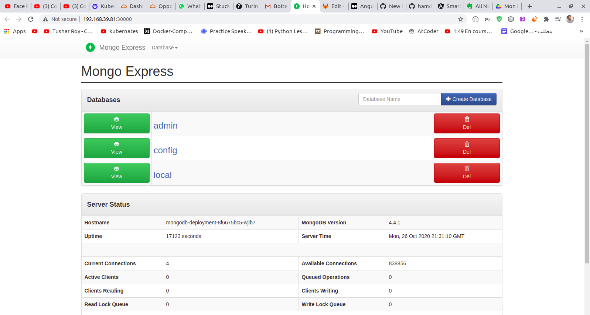
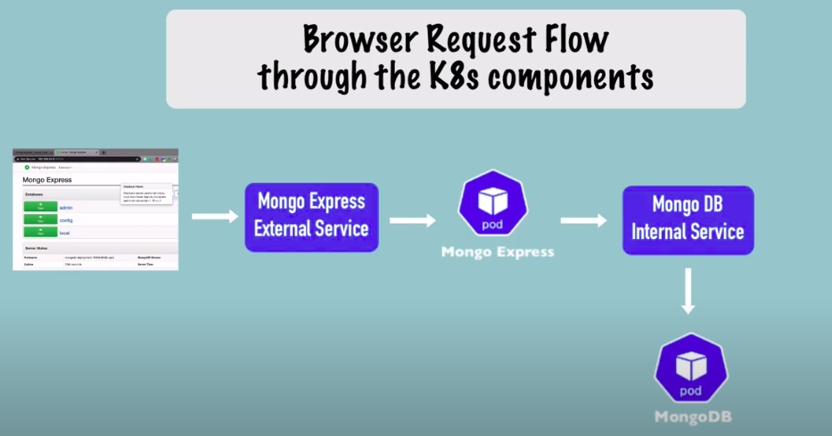

# Kubernates-App

  

## 🎉 What i used in this project  ?

- deployment .
- Services . 
- Secret. 
- ConfigMap . 
- External Services (Load Balancer) . 
- docker images (mongo and mongo-express) . 
- Sharing env variables between pods . 

## 📋 Architecture  ?

  

